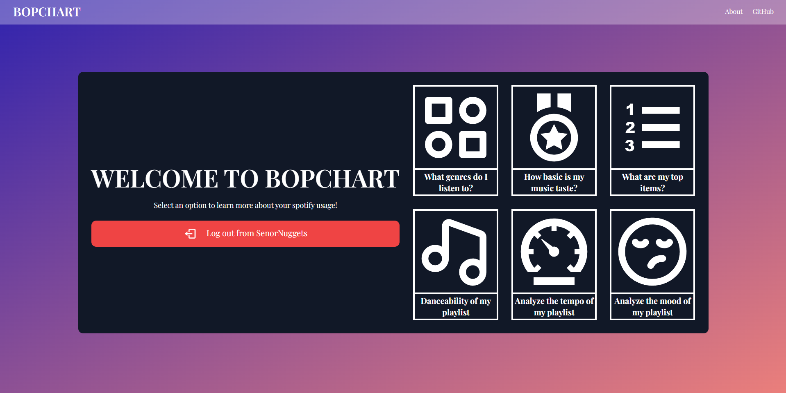
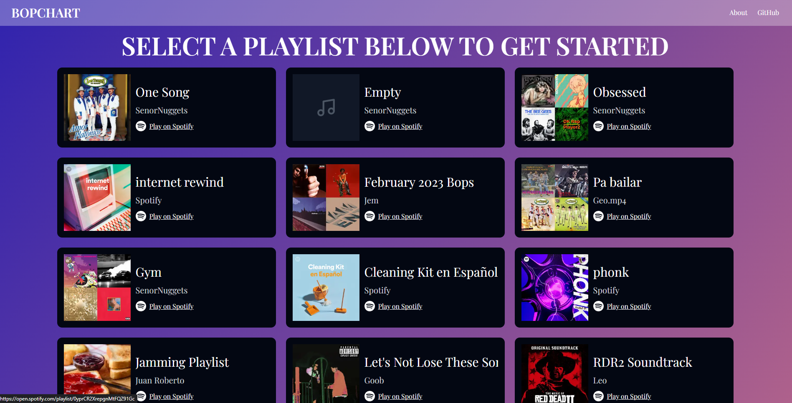
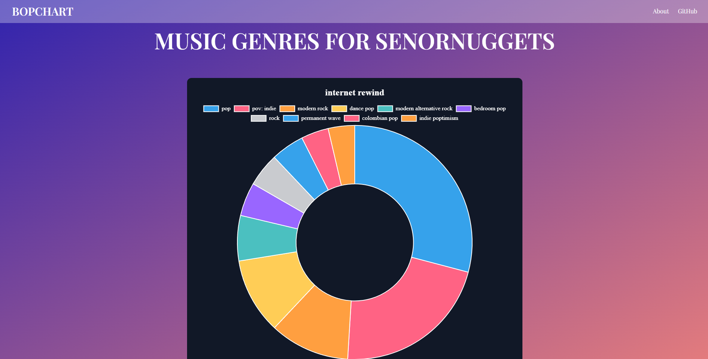

# BopChart - Spotify Usage Statistics

This is a [Next.js](https://nextjs.org/) project bootstrapped with [`create-next-app`](https://github.com/vercel/next.js/tree/canary/packages/create-next-app). Built using React, Tailwind CSS, and ChartJS. This application utilizes Spotify's Web API and authorizes the user using the [OAuth Authorization Code Flow](https://developer.spotify.com/documentation/web-api/tutorials/code-flow). Try BopChart -> https://www.bopchart.com/

**This application is currently in development mode, pending review by Spotify. <u>Spotify limits OAuth sign ins to 25 allowlisted accounts.</u> Request access to this application by emailing eatesting23@gmail.com. Include the email address associated with your Spotify account.**

## Features

BopChart allows you to select a playlist and see the top 10 genres in that playlist. The top 10 genres are determined by summing the duration of each song belonging to that genre. Each song may contain multiple genres. Spotify makes genre information available at the artist level. Playlist containing only one artist, may only have a handful of genres listed.

## Roadmap

- [x] Top genres
  - See your top genres for each playlist

- [ ] Add toast notifications

- [ ] Music taste basicness
  - See how popular your music taste is
- [ ] Top items
  - See what your top items are
- [ ] Danceability
  - See the danceability of each playlist
- [ ] Tempo
  - See statistics related to the tempo of each playlist
- [ ] Mood
  - See the overall vibe of each playlist

